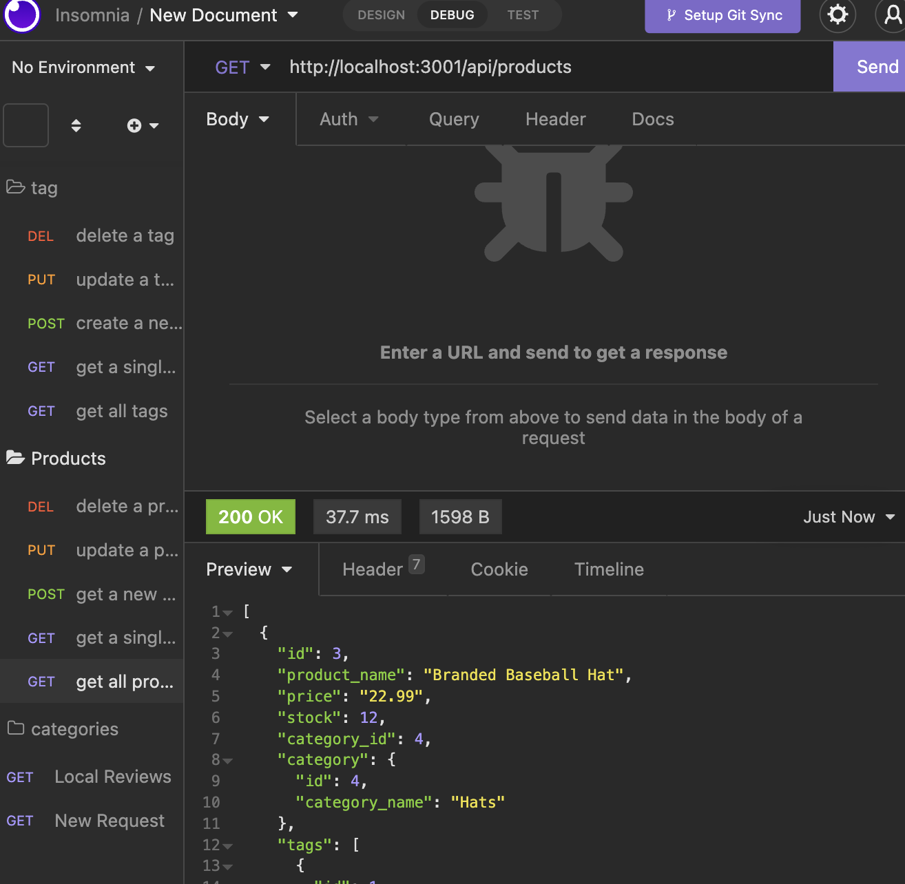

# E Commerce Back end
  
  

    ## Table of Contents
  - [Description](#description)
  - [intallation instructions](#intallation)
  - [ScreenShots](#screen)
  
  - [usage information](#usage)
  - [contribution guidelines](#contribution)

  - [test instructions](#test)
  - [Questions](#Questions)
  - [License](#License)

    ## Description
    This project was created to build out the backend of and e-commence web site. A simple simulation of a web store with out a front end. The routing was not built out and we built it out.

    ## intallation 
    To install this application simply clone the repo to your computer and open up the terminal in vs code and run it using npm strat.

    ## screen
    

    ## usage 

    This applicaiton is used to stimulate the envirment of an e-commerce store.

    ## contribution

    to contribute create a pull request 

    ## test 

    there has been any tests run on this applicaiton currently in the future jest tests will be run.

    ## Questions

    Contact Me At:

    [jessemaun21@gmail.com:](jessemaun21@gmail.com);

    Git Hub:
    [jmaun22:](https://github.com/Jmaun22)

    To contact me you can email me at.

    ## License
    MIT
  
    
    MIT License

    Copyright (c) [2022] [Jesse M]
    
    Permission is hereby granted, free of charge, to any person obtaining a copy
    of this software and associated documentation files (the "Software"), to deal
    in the Software without restriction, including without limitation the rights
    to use, copy, modify, merge, publish, distribute, sublicense, and/or sell
    copies of the Software, and to permit persons to whom the Software is
    furnished to do so, subject to the following conditions:
    
    The above copyright notice and this permission notice shall be included in all
    copies or substantial portions of the Software.
    
    THE SOFTWARE IS PROVIDED "AS IS", WITHOUT WARRANTY OF ANY KIND, EXPRESS OR
    IMPLIED, INCLUDING BUT NOT LIMITED TO THE WARRANTIES OF MERCHANTABILITY,
    FITNESS FOR A PARTICULAR PURPOSE AND NONINFRINGEMENT. IN NO EVENT SHALL THE
    AUTHORS OR COPYRIGHT HOLDERS BE LIABLE FOR ANY CLAIM, DAMAGES OR OTHER
    LIABILITY, WHETHER IN AN ACTION OF CONTRACT, TORT OR OTHERWISE, ARISING FROM,
    OUT OF OR IN CONNECTION WITH THE SOFTWARE OR THE USE OR OTHER DEALINGS IN THE
    SOFTWARE.

    (MIT)[https://choosealicense.com/licenses/mit/]
    

   

  
  